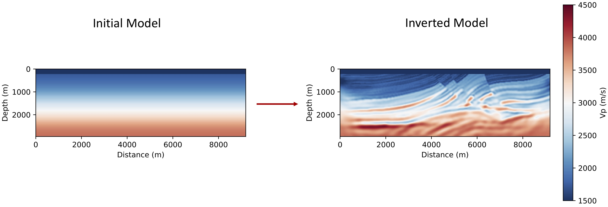

# TorchFWI
TorchFWI is an elastic full-waveform inversion (FWI) package integrated with the deep-learning framework PyTorch. On the one hand, it enables the integration of FWI with neural networks and makes it easy to create complex inversion workflows. On the other hand, the multi-GPU-accelerated FWI component with a boundary-saving method offers high computational efficiency. One can use the suite of built-in optimizers in PyTorch or Scipy (e.g., L-BFGS-B) for inversion.

As a quick start, go to directory *src*, and type
```
python main.py --generate_data
```
Then, type
```
python main.py
```
to start inversion. You can for example add the `--ngpu` flag to use multiple GPUs for forward simulation or inversion. For example,
```
python main.py --ngpu=4
```
The initial model and the inverted model after 80 iterations are shown below.

This package uses just-in-time (JIT) compilation for the FWI code. It only compiles the first time you run the code, and no explicit ''make'' is required. An NVIDIA cuda compiler is needed.

If you find this package helpful in your research, please kindly cite
1. **Dongzhuo Li**, **Kailai Xu**, Jerry M. Harris, and Eric Darve. [*Time-lapse Full-waveform Inversion for Subsurface Flow Problems with Intelligent Automatic Differentiation*](https://arxiv.org/abs/1912.07552).
2. **Dongzhuo Li**, **Jerry M. Harris**, **Biondo Biondi**, and **Tapan Mukerji**. 2019. [*Seismic full waveform inversion: nonlocal similarity, sparse dictionary learning, and time-lapse inversion for subsurface flow.*](http://purl.stanford.edu/ds556fq6692).
3. **Kailai Xu**, **Dongzhuo Li**, Eric Darve, and Jerry M. Harris. [*Learning Hidden Dynamics using Intelligent Automatic Differentiation*](http://arxiv.org/abs/1912.07547).

The **FwiFlow** package, which uses TensorFlow as the backend with additional subsurface flow inversion capabilities, is [*here*](https://github.com/lidongzh/FwiFlow.jl). 
